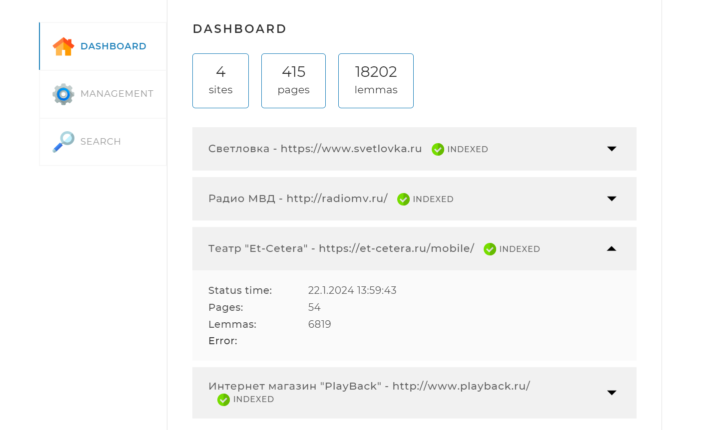

# <u>SearchEngine</u>

## Описание проекта:
Поисковый движок, разработанный с использованием фреймворка Spring.
Осуществляет поиск информации на заданных веб-сайтах, указанных
в конфигурационном файле приложения*(application.yaml)*.    

Предоставляет пользователю специальный API со следующими основными 
функциями:  
 - предварительное индексирование сайтов;
 - получение статистических результатов индексации;
 - повторное индексирование страниц;
 - поиск ключевых слов на проиндексированных страницах и предоставление 
их пользователю.

## Особенности работы с приложением
После запуска программы, по адресу *http://localhost:8080/* станет доступен
веб-интерфейс, позволяющий управлять процессами, реализованными
в данном проекте.   

### Интерфейс приложения:
Представляет собой одну веб-страницу с тремя вкладками:  

### 1. DASHBOARD

Вкладка открывается по умолчанию. На ней
отображается общая статистика по всем проиндексированным сайтам, а также
детальная информация и статус по каждому из сайтов.

### 2. MANAGEMENT

На этой вкладке находятся инструменты управления
поисковым движком — запуск и остановка полной индексации
(переиндексации), а также возможность добавить или обновить
отдельную страницу по ссылке.

### 3. SEARCH

Эта вкладка предназначена для тестирования поискового
движка. На ней находится выпадающий список с выбором проиндексированных 
страниц, а так же поле для ввода поискового запроса. При нажатии на кнопку
*SEARCH* выводится результат поиска, начальной длинны - десять страниц с 
искомым словом.

## Используемые технологии:
 - Приложение построено на платформе ***Spring Boot***
 - Сборка проекта осуществлена с помощью инструмента ***Maven*** 
   подключая необходимые компоненты, прописанные в файле **pom.xml** *(Project Object Model)*
 - Загрузка и разбор HTML - страниц осуществляется с помощью библиотеки ***JSOUP***
   с применением технологии многопоточного режима выполнения поставленных задач.
 - В проекте используются библиотеки для леммитизации слов при индексации: 
   ***LuceneMorphology for Apache Lucene и RussianLuceneMorphology***
 - Данная версия программы работает с СУБД ***MySQL***
 - Для удобства написания и чтения программного кода, а так же расширения 
   функциональности языка **Java** используется библиотека ***Lombok***

## Запуск приложения
Исходный код с программой ***SearchEngine*** можно скачать по адресу:
[https://gitlab.skillbox.ru/konstantin_vorobev_4/searchengine.git](https://gitlab.skillbox.ru/konstantin_vorobev_4/searchengine.git)

Необходимо загрузить на локальный диск все компоненты проекта по указанной выше ссылке,
для дальнейшей сборки и запустить с помощью среды разработки *IntelliJ IDEA*.

Перед первой компиляцией программы следует выполнить следующие действия:

1. Установить СУБД — **MySQL**, если они ещё не установлены
2. В базе данных создать схему *search_engine*. Имя схемы может быть и другим, 
   но тогда это должно быть отражено в параметре *spring.datasource* в файле *application.yaml*
3. В схеме в строке *spring.datasource.username* в файле *application.yaml* необходимо указать 
   пользователя и прописать пароль в строке *password*, используемые для доступа к СУБД
4. Установить фреймворк **Apache Maven** в среду разработки *IntelliJ IDEA*, если он ещё 
   не установлен, для сборки приложения.

Теперь приложение можно компилировать и запускать из программной среды.  

Так же программу можно запустить с помощью двойного клика ЛКМ по файлу ***SearchEngine.jar***,
расположенному в репозитории проекта по пути *SearchEngine\out\artifacts\SearchEngine_jar*

## Системные требования:
- Java 20 или выше
- Maven 4.0 или выше
- MySql 8 или выше

  

